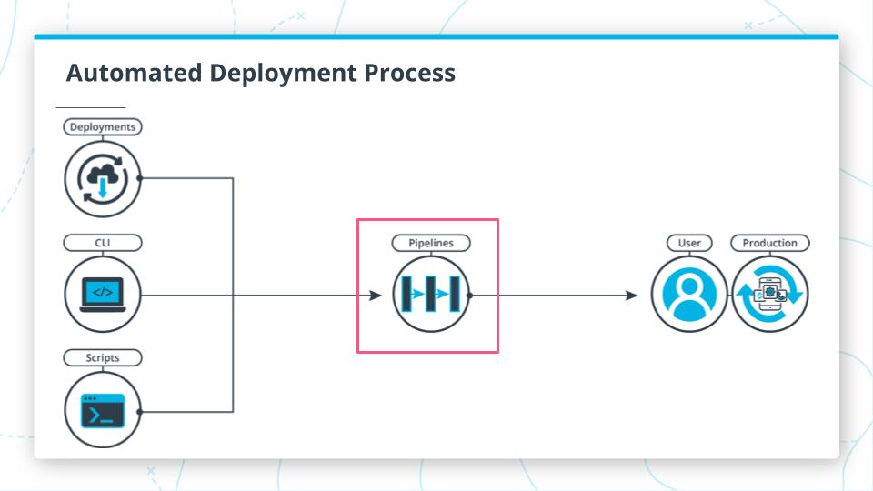

## Pipeline Process

- We are using **CircleCI** to build the pipeline.
- In the pipeline we are using node, aws-cli, elastic-beanstalk orbs for setup environment.
- We are maintaining two different pipelines each for frontend and backend.
- Two different circle-ci configs are there one for frontend and other for backend.
- CircleCI automates everything from linting, testing, building our app and deploys it to aws services. The `config.yml` of circle has numerous commands that help circle ci to automate process.